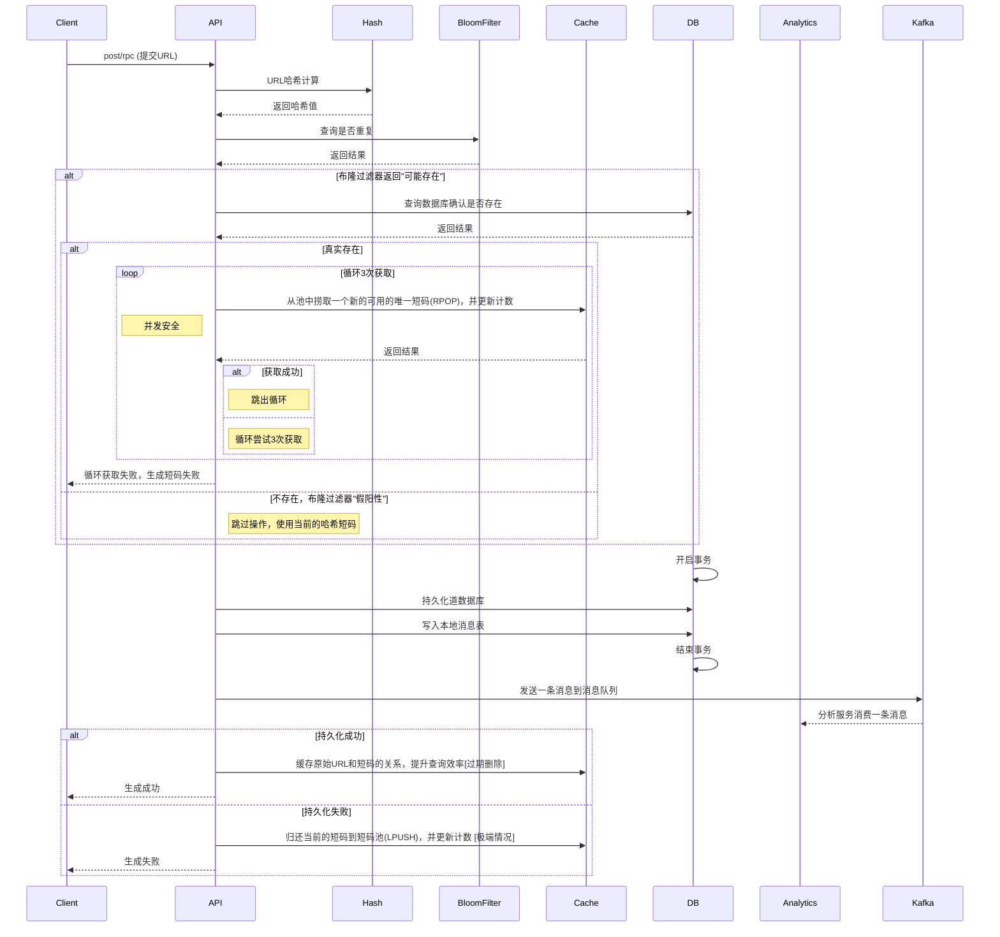
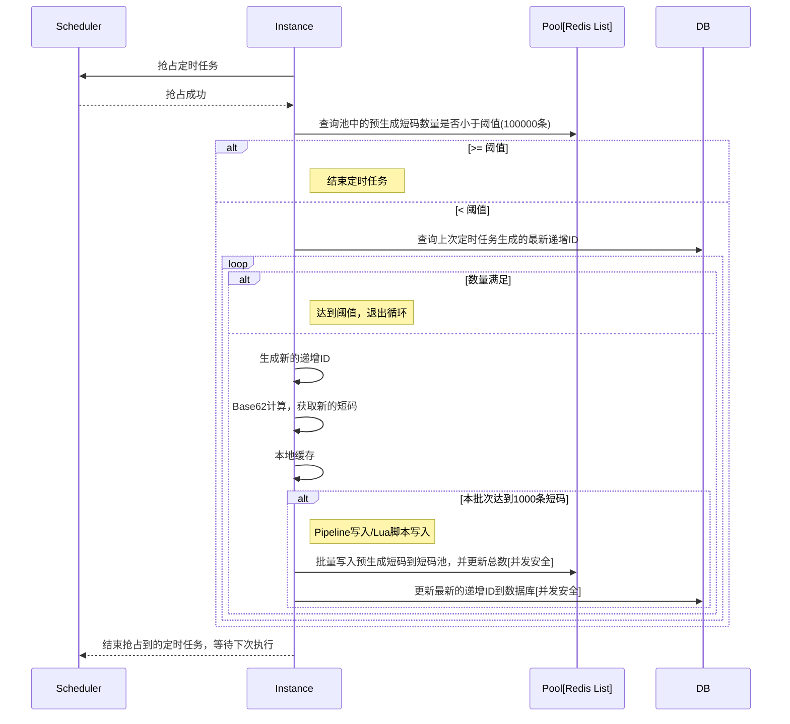

# generator
Go URL短码生成服务

### 1. 单条短码生成流程

```mermaid
sequenceDiagram
    participant Client
    participant API
    participant Hash
    participant BloomFilter
    participant Cache
    participant DB
    participant Analytics
    participant Kafka

    Client->>API: post/rpc (提交URL)
    API->>Hash: URL哈希计算
    Hash-->>API: 返回哈希值
    API->>BloomFilter: 查询是否重复
    BloomFilter-->>API: 返回结果
    alt 布隆过滤器返回"可能存在"
        API ->> DB: 查询数据库确认是否存在
        DB -->> API: 返回结果
        alt 真实存在
            loop 循环3次获取
                API ->> Cache: 从池中捞取一个新的可用的唯一短码(RPOP)，并更新计数
                note left of API: 并发安全
                Cache -->> API: 返回结果
                alt 获取成功
                    note right of API: 跳出循环
                else
                    note right of API: 循环尝试3次获取
                end
            end
            API -->> Client: 循环获取失败，生成短码失败
        else 不存在，布隆过滤器"假阳性"
            note right of API: 跳过操作，使用当前的哈希短码
        end
    end
    DB ->> DB: 开启事务
    API ->> DB: 持久化道数据库
    API ->> DB: 写入本地消息表
    DB ->> DB: 结束事务
    API ->> Kafka: 发送一条消息到消息队列
    Kafka -->> Analytics: 分析服务消费一条消息
    alt 持久化成功
        API ->> Cache: 缓存原始URL和短码的关系，提升查询效率[过期删除]
        API -->> Client: 生成成功
    else 持久化失败
        API ->> Cache: 归还当前的短码到短码池(LPUSH)，并更新计数 [极端情况]
        API -->> Client: 生成失败
    end

```

### 2. 短码池预生成流程
采用递增序列+Base62算法

```mermaid
sequenceDiagram
    participant Scheduler
    participant Instance
    participant Pool[Redis List]
    participant DB
    
    Instance ->> Scheduler: 抢占定时任务
    Scheduler -->> Instance: 抢占成功
    Instance ->> Pool[Redis List]: 查询池中的预生成短码数量是否小于阈值(100000条)
    alt >= 阈值
        note right of Instance: 结束定时任务
    else < 阈值
        Instance ->> DB: 查询上次定时任务生成的最新递增ID
        loop
            alt 数量满足
                note right of Instance: 达到阈值，退出循环
            else
                Instance ->> Instance: 生成新的递增ID
                Instance ->> Instance: Base62计算，获取新的短码
                Instance ->> Instance: 本地缓存
                alt 本批次达到1000条短码
                    note right of Instance: Pipeline写入/Lua脚本写入
                    Instance ->> Pool[Redis List]: 批量写入预生成短码到短码池，并更新总数[并发安全]
                    Instance ->> DB: 更新最新的递增ID到数据库[并发安全]
                end
            end
        end
    end
    
    Instance -->> Scheduler: 结束抢占到的定时任务，等待下次执行
```
